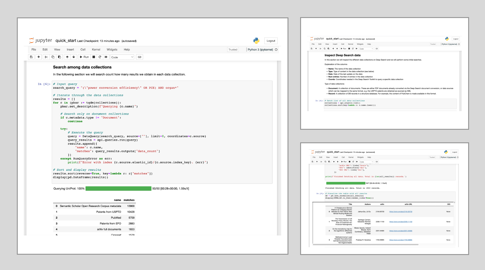

# Deep Search Examples


[](https://mybinder.org/v2/gh/DS4SD/deepsearch-examples/main)
[](https://opensource.org/licenses/MIT)
[](https://github.com/psf/black)
[](https://ds4sd.github.io/deepsearch-toolkit/)
[](https://mybinder.org/v2/gh/DS4SD/deepsearch-examples/main)


In this repository we showcase some common usage of Deep Search
for **Document conversion** as well as **Data and Knowledge exploration**.


## Quick links

- [Deep Search Toolkit](https://github.com/ds4sd/deepsearch-toolkit)
- [Documentation](https://ds4sd.github.io/deepsearch-toolkit/)


## Examples

### Setup and usage

Each example starts by defining its input parameters. This is supported by Pydantic
Settings, allowing automated loading from a `.env` file or env vars. Furthermore, access
is based on [Profiles][profiles]. To set up a profile, visit `<HOST_URL>/credentials`
(e.g. for SDS that would be: https://sds.app.accelerate.science/credentials). Unless
otherwise configured, the profile used is the active one.

### Document conversion

|    | Name              | Description |
| -- | ----------------- | ----------- |
| 1. | [Convert documents quick start][doc_conv_quick_start] | Full example on programmatic document conversion <br /> [][doc_conv_quick_start] |
| 2. | [Convert documents with custom settings][doc_conv_custom_pipeline] | Full example on programmatic document conversion with custom conversion settings <br /> [][doc_conv_custom_pipeline] |
| 3. | [Visualize bounding boxes][doc_conv_visualize_bbox] | Visualize the bbox of the text elements <br /> [][doc_conv_visualize_bbox] |
| 4. | [Extract figures from documents][doc_conv_extract_figures] | Given a PDF file, extract the figures <br /> [][doc_conv_extract_figures] |
| 5. | [Extract tables][doc_conv_extract_tables] | Given a PDF file, extract the tables <br /> [][doc_conv_extract_tables] |


### Data queries

This section will showcase examples which query data processed via Deep Search.

|    | Name              | Description |
| -- | ----------------- | ----------- |
| 1. | [Data query quick start][data_query_quick_start] | Example listing data collections, making search in one and more document collections, using source for projection <br /> [][data_query_quick_start] |
| 2. | [Chemistry search queries][data_query_chemistry] | Search the chemistry databases for known molecules <br /> [][data_query_chemistry] |
| 3. | [Chemistry and patent searches via PatCID][data_query_chemistry_patcid] | Explore the chemistry databases using substructure and similarity searches and navigate to the world-wide patents which reference molecules <br /> [][data_query_chemistry] |
| 4. | [Snippets and aggregations in data queries][data_query_snippets] | Extract snippets in search queries and leverage aggregations for exploratory analysis <br /> [][data_query_snippets] |
| 5. | [Document QA][document_qa] | Interact with your documents using Conversational AI <br /> [][document_qa] |


### Bring your own

This section will showcase examples for bringing your own documents, csv data, nlp models and more.

|    | Name              | Description |
| -- | ----------------- | ----------- |
| 1. | [Bring your own PDF][bring_your_own_pdf] | Upload your own PDF documents, search on them and export the result as JSON files. <br /> [][bring_your_own_pdf] |
| 2. | Bring your own DataFrame | Bring your own DataFrame from CSV, XLSX, etc and explore the content in a knowledge graph <br /> |


### Attachments and metadata

This section will showcase examples for managing index item attachments and metadata.

|    | Name              | Description |
| -- | ----------------- | ----------- |
| 1. | [Manage attachments][manage_attachments] | Manage index item attachments <br /> [][manage_attachments] |


### Knowledge graphs

This section will showcase examples related to the use of knowledge graphs (KGs) in Deep Search.

|    | Name               | Description |
| -- | ------------------ | ----------- |
| 1. | [Using Deep Search KGs with PyTorch Geometric][kg_download_quick_start] | Download knowledge graphs from Deep Search and import them in PyTorch Geometric. <br /> [][kg_download_quick_start] |

### Integrations

This section will showcase examples related to the integration of Deep Search with other tools and utilities.

|    | Name               | Description |
| -- | ------------------ | ----------- |
| 1. | [Annotations on argilla.io][integration_argilla] | Use [argilla.io](https://argilla.io/) for annotating the content of documents. <br /> [][integration_argilla] |


## Example dependencies

The examples contained in this catalog depend on the `deepsearch-toolkit` as well as
other modules needed for the showcase demonstrated (e.g. `pandas`, `matplotlib`, `rdkit`, etc).
Please refer to the poetry `pyproject.toml` or  `requirements.txt` for a complete list.

Python dependencies are installed with

```console
pip install -r requirements.txt
```

Additionally, some examples rely on system packages. When this is the case, the README of the individual
example will contain more details on which package is required.
The auxiliary file [apt.txt](./apt.txt) list all such packages for a Debian-bases OS. They can be installed with

```console
xargs sudo apt-get install < apt.txt
```


## License

The `Deep Search Toolkit` codebase is under MIT license.
For individual model usage, please refer to the model licenses found in the original packages.

[doc_conv_quick_start]: ./examples/document_conversion_quick_start/
[doc_conv_custom_pipeline]: ./examples/document_conversion_custom_settings/
[doc_conv_visualize_bbox]: ./examples/document_conversion_visualize_bbox/
[doc_conv_extract_figures]: ./examples/document_conversion_extract_figures/
[doc_conv_extract_tables]: ./examples/document_conversion_extract_tables/
[data_query_quick_start]: ./examples/data_query_quick_start/
[data_query_snippets]: ./examples/data_query_snippets/
[data_query_chemistry]: ./examples/data_query_chemistry/
[data_query_chemistry_patcid]: ./examples/data_query_chemistry_patcid/
[document_qa]: ./examples/document_qa/
[bring_your_own_pdf]: ./examples/bring_your_own_pdf/
[manage_attachments]: ./examples/attachment_management/
[kg_download_quick_start]: ./examples/kg_download_quick_start/
[integration_argilla]: ./examples/integration_argilla/
[json_export]: ./examples/json_export/
[profiles]: https://ds4sd.github.io/deepsearch-toolkit/guide/configuration/#profiles
