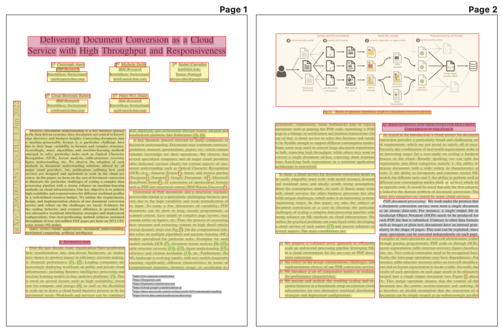
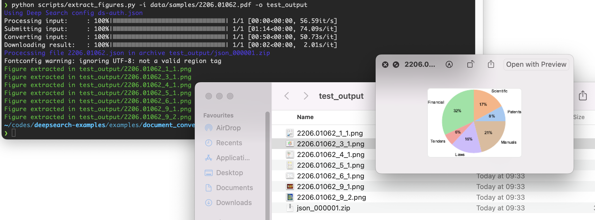
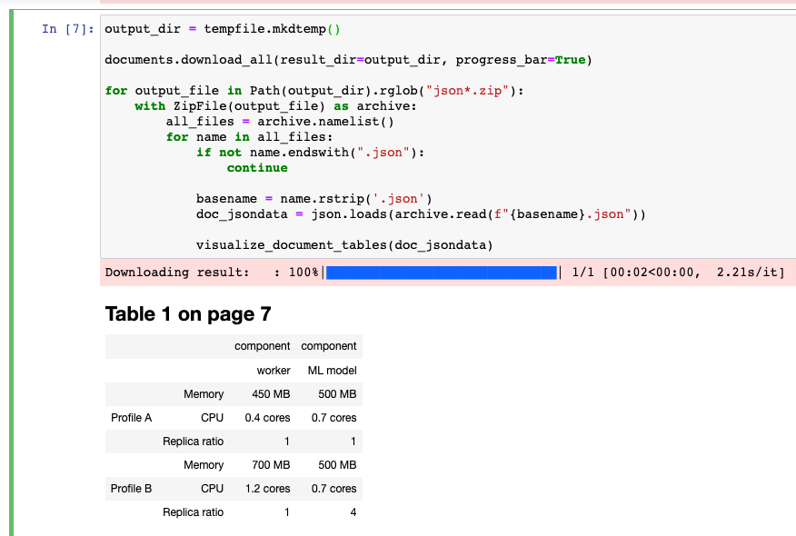

# Document conversion examples

## TL;DR Simply convert a document

```shell
pip install deepsearch-toolkit
```

```py
host = "https://deepsearch-experience.res.ibm.com"
proj = "1234567890abcdefghijklmnopqrstvwyz123456"

username = "<fill-in-your-username>"    # <-- TODO: fill this
api_key = "<fill-in-your-api-key>"      # <-- TODO: fill this

auth = ds.DeepSearchKeyAuth(username=username, api_key=api_key)
config = ds.DeepSearchConfig(host=host, auth=auth)
client = ds.CpsApiClient(config)
api = ds.CpsApi(client)

documents = ds.convert_documents(
    api=api,
    proj_key=proj,
    source_path="<path-to-file>",       # <-- TODO: fill this
    progress_bar=True
)
documents.download_all(result_dir="./converted_docs")
info = documents.generate_report(result_dir="./converted_docs")
print(info)
```

## Complete examples

> Examples rely on having valid credentials in the file `ds-auth.json`.
> To obtain your credentials, please refer to the documentation page https://ds4sd.github.io/deepsearch-toolkit/getting_started/#authentication.
> The file can also be generated via `deepsearch login --output ds-auth.json`

<details>
  <summary>See example</summary>

```json
{
    "host": "https://deepsearch-experience.res.ibm.com",
    "auth": {
        "username": "FILL ME",
        "api_key": "FILL ME"
    },
    "verify_ssl": true
}
```

</details>

|    | Name              | Description |
| -- | ----------------- | ----------- |
| 1. | [convert_documents.ipynb](notebooks/convert_documents.ipynb) | Full example on programmatic document conversion |
| 2. | [visualize_bbox.ipynb](notebooks/visualize_bbox.ipynb) | Visualize the bbox of the text elements <br />  |
| 3. | [extract_figures.py](scripts/extract_figures.py) | Given a PDF file, extract the figures <br />  |
| 4. | [extract_tables.py](scripts/extract_tables.py) [script version] <br /> [extract_tables.ipynb](notebooks/extract_tables.ipynb) [notebook version] | Given a PDF file, extract the tables <br />  |


### Additional dependencies

Some visualization in the examples are converting a PDF document with Deep Search and exports the figures into PNG files.

The PDF to image conversion relies on the `pdftoppm` executable of the Poppler library (GPL license)
https://poppler.freedesktop.org/
The Poppler library can be installed from the most common packaging systems, for example
- On macOS, `brew install poppler`
- On Debian (and Ubuntu), `apt-get install poppler-utils`
- On RHEL, `yum install poppler-utils`
